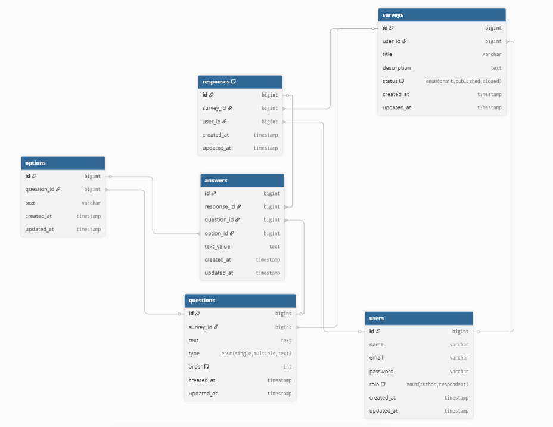

# Survey API

REST API сервиса опросов и голосований.

Стек: **PHP 8 / Laravel 11 / Eloquent / MySQL**

---

## Описание

Платформа для создания анкет с разными типами вопросов, сбора ответов от респондентов и просмотра аналитики результатов.

---

## Роли пользователей

| Роль | Что может |
|---|---|
| `author` | Создавать и управлять опросами, просматривать аналитику |
| `respondent` | Проходить опубликованные опросы |

Один пользователь может быть и автором, и респондентом.

---

## Структура проекта

```
├── docs/
│   └── er-diagram.png  # ER-диаграмма БД
├── src/                # Laravel-приложение
├── Dockerfile
├── docker-compose.yml
└── README.md
```

---

## Запуск (локально)

```bash
cd src
cp .env.example .env
composer install
php artisan key:generate
php artisan migrate
php artisan db:seed
php artisan serve
```

API доступно на: `http://localhost:8000/api`

---

## API Эндпоинты

### Аутентификация

| Метод | URL           | Описание           | Авторизация |
| ----- | ------------- | ------------------ | ----------- |
| POST  | /api/register | Регистрация        | —           |
| POST  | /api/login    | Вход, получить JWT | —           |
| POST  | /api/logout   | Выход              | Bearer JWT  |

### Опросы

| Метод  | URL                       | Описание                            | Роль                  |
| ------ | ------------------------- | ----------------------------------- | --------------------- |
| GET    | /api/surveys              | Список опросов (фильтры, пагинация) | Все                   |
| POST   | /api/surveys              | Создать опрос                       | author                |
| GET    | /api/surveys/{id}         | Детали опроса с вопросами           | Все                   |
| PUT    | /api/surveys/{id}         | Редактировать опрос                 | author (только draft) |
| DELETE | /api/surveys/{id}         | Удалить опрос                       | author (только draft) |
| POST   | /api/surveys/{id}/publish | Опубликовать опрос                  | author                |
| POST   | /api/surveys/{id}/close   | Закрыть опрос                       | author                |

### Вопросы

| Метод  | URL                               | Описание             | Роль                  |
| ------ | --------------------------------- | -------------------- | --------------------- |
| POST   | /api/surveys/{id}/questions       | Добавить вопрос      | author (только draft) |
| PUT    | /api/surveys/{id}/questions/{qid} | Редактировать вопрос | author (только draft) |
| DELETE | /api/surveys/{id}/questions/{qid} | Удалить вопрос       | author (только draft) |

### Варианты ответов

| Метод  | URL                                | Описание         | Роль                  |
| ------ | ---------------------------------- | ---------------- | --------------------- |
| POST   | /api/questions/{qid}/options       | Добавить вариант | author (только draft) |
| DELETE | /api/questions/{qid}/options/{oid} | Удалить вариант  | author (только draft) |

### Прохождение и аналитика

| Метод | URL                         | Описание                   | Роль       |
| ----- | --------------------------- | -------------------------- | ---------- |
| POST  | /api/surveys/{id}/responses | Пройти опрос               | respondent |
| GET   | /api/surveys/{id}/analytics | Аналитика результатов      | author     |
| GET   | /api/surveys/{id}/export    | Экспорт результатов (JSON) | author     |

---

## Жизненный цикл опроса

`draft` → `published` → `closed`

- **draft** — можно редактировать структуру
- **published** — принимаются ответы, структура заморожена
- **closed** — новые ответы не принимаются

---

## ER-диаграмма


